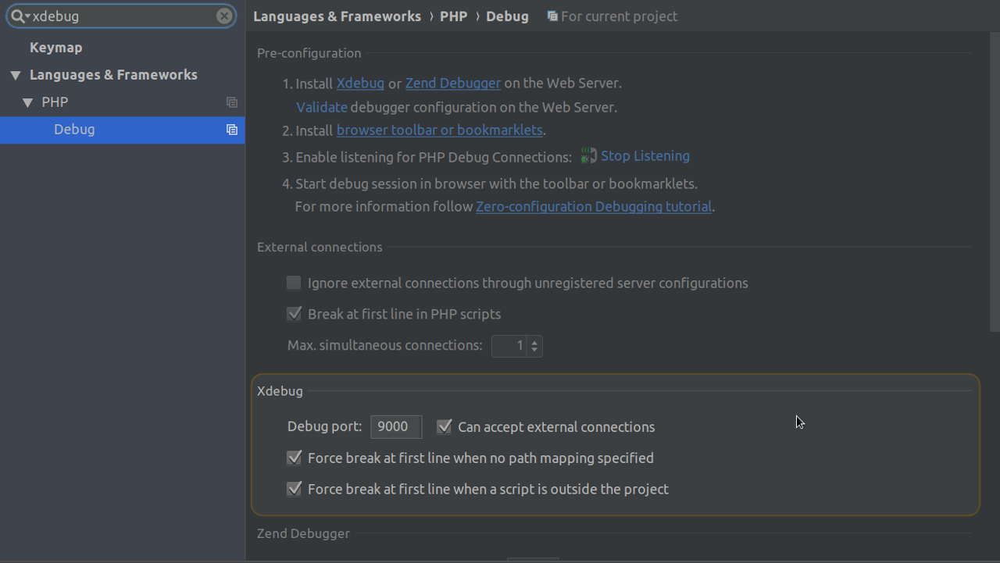
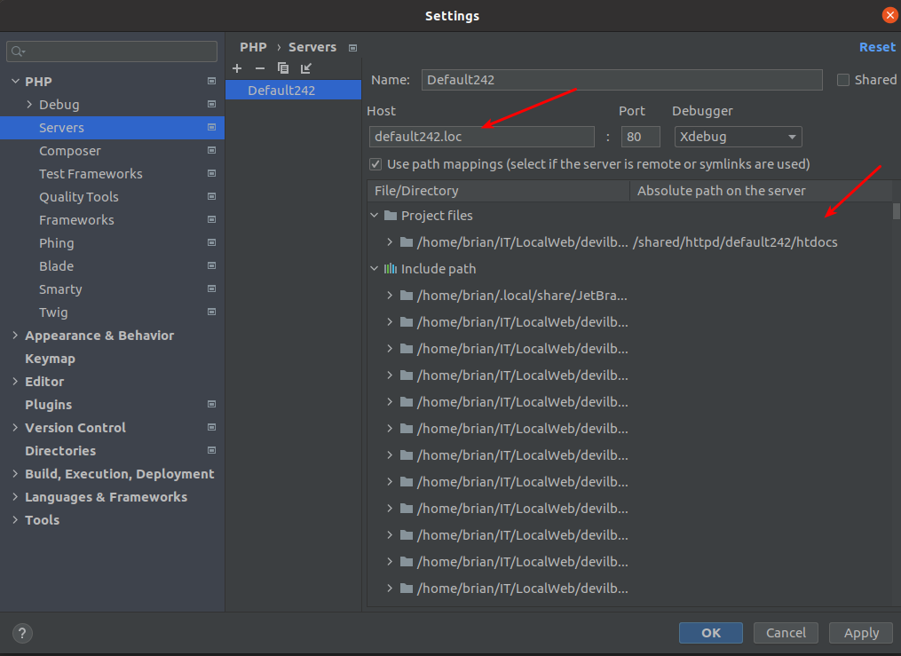
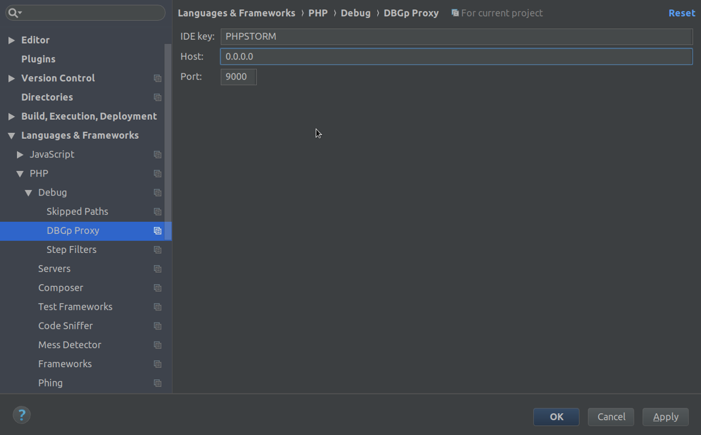

    <h1 align="center">Magento 2</h1>

## Configure Xdebug

### Enable Xdebug for PHP7.4 & PHPStorm
#### Use Command as below to enable xdebug in Devilbox:

> cd /{path}/devilbox

> cp cfg/php-ini-7.4/devilbox-php.ini-magento2 devilbox-php.ini

Note: Only enable Xdebug when need to debug function, because it might affect to php execute time.

#### Configure Xdebug in PHPStorm:

1. Ensure Xdebug port is set to 9000
   
2. Set path mapping
   
3. Ensure DBGp proxy settings are configured
   

#### Fix bug Mysql cannot start when switch version
  1. docker volume create --name devilbox-mysql-{version} -d local
  2. Edit docker-compose.yml
> volumes:
> 
> devilbox-mysql-{version}:
> 
> external: true
